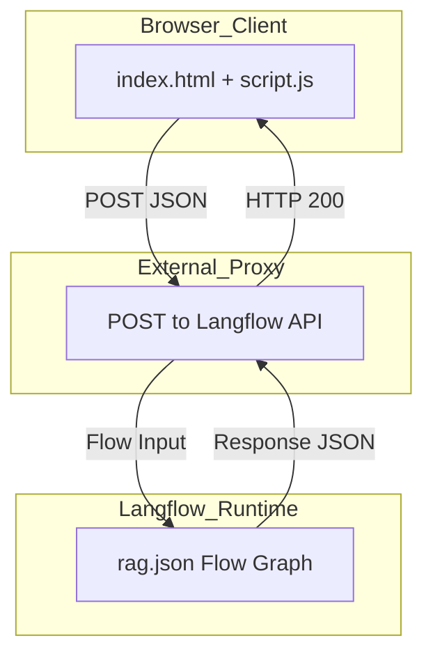
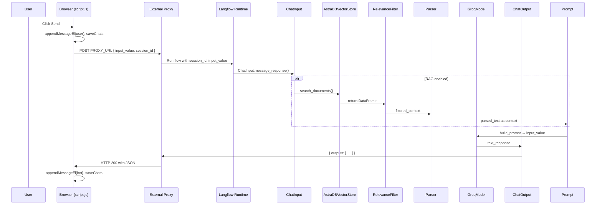

# Runtime topology: static web UI + external proxy + Langflow flow execution

# System Architecture and Data Flow Feature Documentation

## Overview

The System Architecture and Data Flow feature of Nami-AI defines how user interactions traverse from a static browser interface to an external proxy and into a Langflow execution graph. Users type messages in a lightweight chat UI served entirely from `index.html` and `script.js`. These messages are posted to a remote proxy, which forwards them into a Langflow flow defined by **ai marketing agent with rag.json**. The flow executes components for chat I/O, optional RAG retrieval, LLM inference with Groq, data parsing, and returns a structured JSON response. This topology cleanly separates trust boundaries—keeping UI logic client-side, offloading inference to a proxy, and orchestrating AI components within the Langflow runtime hosted on Hugging Face Spaces  .

## Architecture Overview



## Component Structure

### 1. Presentation Layer

#### **index.html** (`/index.html`)

- Hosts the static chat UI: sidebar, welcome screen, message list, and input footer.
- References `script.js` for all interactive behavior .
- No server-side rendering; fully client-side DOM manipulation.

#### **script.js** (`/script.js`)

- Manages chat state in `localStorage` under key `nami_chats`.
- Defines `PROXY_URL` constant pointing to the external proxy endpoint .
- Implements:- `handleSendMessage()`: validates input, updates UI, and `fetch(PROXY_URL, { method: 'POST', body: JSON.stringify({ input_value, output_type: 'chat', input_type: 'chat', session_id }) })` .
- UI helpers: `appendMessageEl()`, `showTyping()`, `removeTyping()`.
- Chat lifecycle: `newChat()`, `loadChat()`, `deleteChat()`, `renderHistory()`, `saveChats()`.

### 2. Proxy Layer

- Hosted externally (e.g., Cloudflare Workers at `https://nami-proxy.anaslachmi.workers.dev`).
- Accepts POST requests from the browser, with payload:

```json
  {
    "input_value": "<user text>",
    "output_type": "chat",
    "input_type": "chat",
    "session_id": "<timestamp id>"
  }
```

- Forwards request to the Langflow flow-run API and returns its JSON response unmodified.
- Handles network errors and returns HTTP error status to the client.

### 3. Langflow Flow Execution

The flow graph **ai marketing agent with rag.json** defines the sequence of components executed per request:

- **ChatInput**: ingests the incoming message, constructs a `Message` object, and optionally stores it .
- **AstraDBVectorStore**: (optional) retrieves contextual embeddings from Astra DB for RAG .
- **RelevanceFilter**: filters retrieved documents based on score threshold and content presence .
- **Parser**: formats `DataFrame` or `Data` into a `Message` template, preparing text fragments .
- **Prompt**: combines history, context, and question into a final prompt.
- **GroqModel**: invokes the Groq LLM on the constructed prompt, returning a `Message` response .
- **ChatOutput**: outputs the final `Message` back to the proxy.

## Data Flow

### Primary Chat Flow



### Client Response Parsing

```javascript
const outputs = data?.outputs?.[0]?.outputs?.[0];
const reply = outputs?.results?.message?.text || '…';
```

This logic resides in `handleSendMessage()` .

## Trust Boundaries

- **Browser (Client)**: Executes UI and persists chats locally; cannot access LLM keys.
- **External Proxy**: Trusted to shield the UI from direct LLM access; enforces CORS and security rules.
- **Langflow Runtime**: Runs within a Dockerized Hugging Face Space as per `README.md`  ; hosts the flow graph with component isolation.
- **LocalStorage**: Data remains on the user’s device; no PII or credentials stored.

## Key Components Reference

| Component | Responsibility |
| --- | --- |
| index.html | Static HTML chat UI |
| script.js | Client logic: state, UI updates, proxy communication |
| External Proxy | HTTP endpoint for forwarding chat requests |
| ai marketing agent with rag.json | Langflow flow graph definition |
| ChatInput | Ingests and processes incoming chat messages |
| AstraDBVectorStore | Retrieves RAG context from Astra DB |
| RelevanceFilter | Filters RAG results by relevance threshold |
| Parser | Formats structured data into a conversational message |
| Prompt | Builds dynamic LLM prompt with history/context/question |
| GroqModel | Performs LLM inference via Groq API |
| ChatOutput | Produces the final chat response object for the proxy |


---
Source: https://app.docuwriter.ai/space/41882/item/472051
